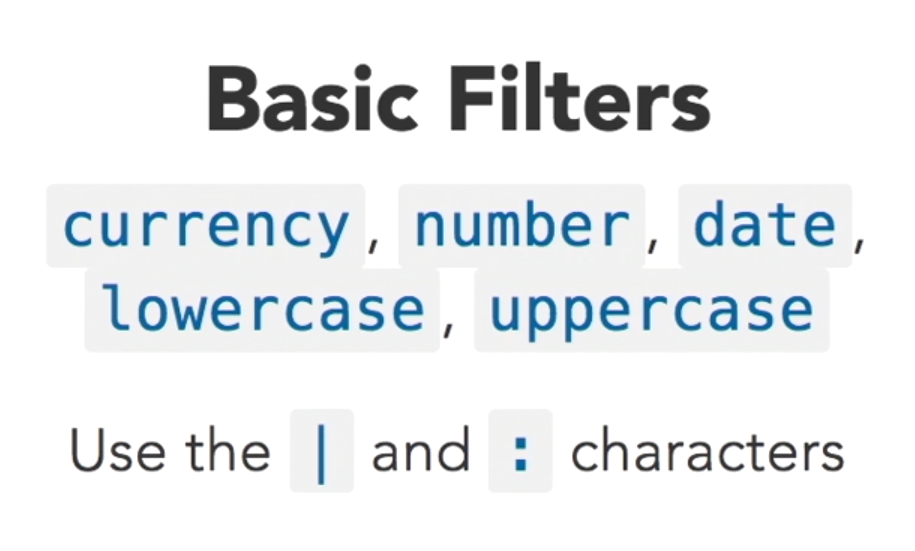

# angularjs

# features
let you create and SPA

## arquitecture
MVC - model view controller
M : $scope
V : html file
C : js file

## Data binding
connect the view with the controller and the controller with the view

# directives
- simple attribute
- tag

# angularjs vs angular
- angular is oriented to components while angularjs is oriented to MVC
- less tolling to work with
- simpler

# gulpfile
let you package all your application in a bunch of optimized files
```javascript
var gulp = require("gulp"),
  browserSync = require("browser-sync").create(),
  source = "./src/",
  dest = "./dest/";

function html() {
  return gulp.src(dest + "**/*.html");
}

function js() {
  return gulp.src(dest + "**/*.js");
}

function styles() {
  return gulp.src(dest + "**/*.css");
}

function watch() {
  gulp.watch(source + "js/**/*.js", js).on("change", browserSync.reload);
  gulp.watch(source + "css/**/*.css", styles).on("change", browserSync.reload);
  gulp.watch(source + "index.html", html).on("change", browserSync.reload);
}
function server() {
  browserSync.init({
    notify: false,
    server: {
      baseDir: source
    }
  });
}

  gulp.watch(source + "css/**/*.css", styles).on("change", browserSync.reload);
  gulp.watch(source + "index.html", html).on("change", browserSync.reload);
  gulp.watch(source + "index.html", js).on("change", browserSync.reload);

var build = gulp.series(gulp.parallel(js, styles, html), server, watch);

gulp.task("default", build)
```

# ng-app directive
angular application
- by default it creates an app
- you can specified another app name
- you can have several apps in the same html page

```html
<!DOCTYPE html>
<html lang="es">
<head>
    <meta charset="utf-8" />
    <meta name="description" content="" />
    <meta name="viewport" content="width=device-width, initial-scale=1" />
    <script src="lib/angular/angular.min.js"></script>
    <script src="lib/angular/angular-route.min.js"></script>
</head>
<body>
    <div ng-app="appChat">
        this is the chat
    </div>
</body>
</html> 
```

# module
each app is a module, you can create modules and inject them in another module
- a module for controllers
- a module for directives
- a module for utils

```javascript
var app=angular.module("appChat", []);
```

# controller
a module is a bunch of controllers, directives, and so on
```javascript
app.controller("chatController", ["$scope", ($scope) => {
    $scope.name = "test name";
}]);
```

# src vs ng-src
browser process src before any other application, try to get all from cache, using ng-src we avoid 404 error code, the src will be applied once angular get's load

```html

```

# ng-show, ng-hide
it creates the element in the DOM, and just show or hide base on css
```html
 10" /> 
 10" />
```

# ng-if
base on the condition, paint or not an element in the DOM

# services
# $http services
let you get data from web services
- base on promises

### $http returned value
the service wraps the data in the next structure
- config
- data
- header
- status
- statusText

```javascript
app.controller("dataController", ["$scope", "$http", ($scope, $http) => {
    $scope.name = "test name";
    $scope.data = [];
    $http.get("/data.json").then((response) => {
        $scope.data = response.data;
    });
}]);
```

# Filters
- date
- currency
- lowercase
- uppercase

  
they are used in the html files, mainly for apply some transformation to the data

## lowercase filter
```html
<div>{{e.description | lowercase}}</div>
```

## uppercase filter
```html
<div>{{e.name | uppercase}}</div>
```

# Array filters
## limitTo
let you limit the amount of data to show in a list
```html
<div ng-repeat="item in filters | limitTo:2:2">
</div>
```

## filter
let you filter in the collection by a variable
```html
<div ng-repeat="item in filters | filter:query">
</div>
```

## orderBy
let you sort the ng-repeat by an attribute
```html
<div ng-repeat="item in data | orderBy: 'name' : 'reverse'">
</div>
```

# ng-view
